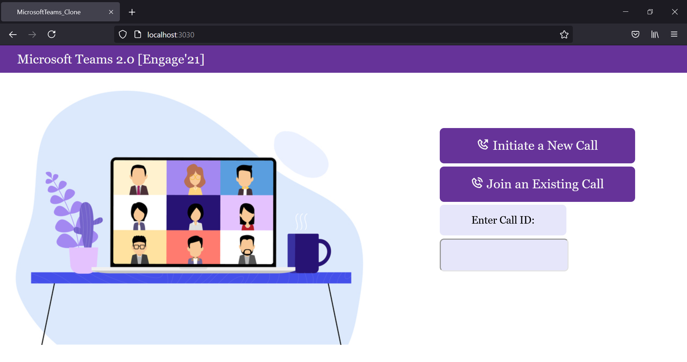

# Microsoft Teams Clone [Engage'21]
A functional prototype of a Microsoft Teams clone built with the help of Node.js, Express, EJS, PeerJS, Socket.IO and uuid.

## Setup
1. Download the repository to your system.
2. Open the project directory.
3. Open the Command Prompt, reach the directory and run the following commands:
    - npm install
    - npm start
4. The application can be accessed at http://localhost:3030/.

## Acknowledgements
This project was inspired by https://levelup.gitconnected.com/building-a-video-chat-app-with-node-js-socket-io-webrtc-26f46b213017.

## Screenshots

